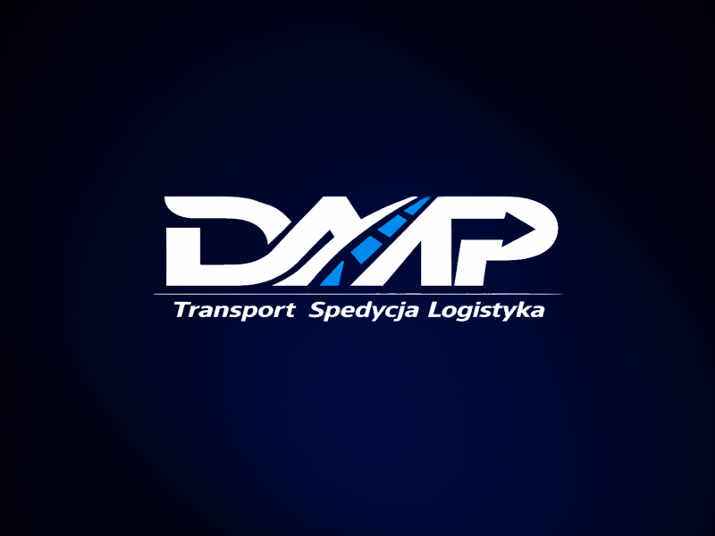
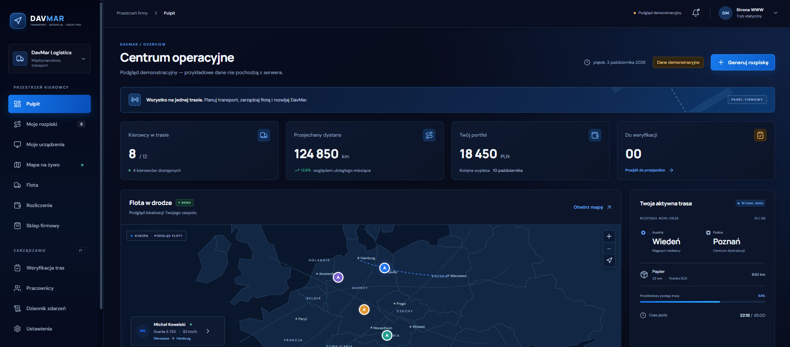
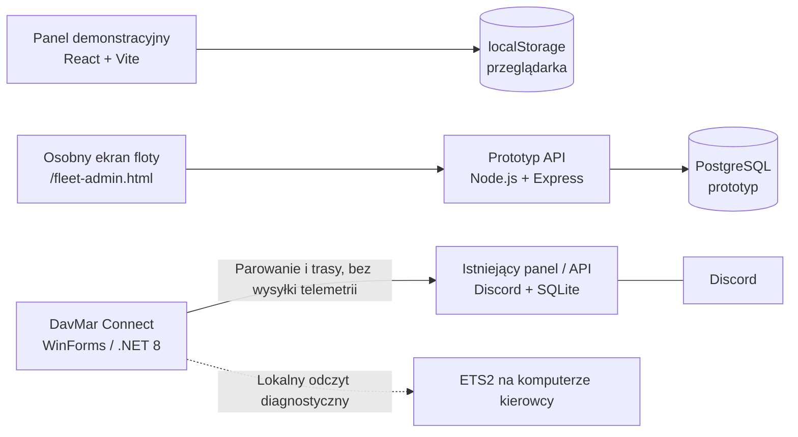

<p align="center">
  
</p>

<p align="center">
  
</p>
<p align="center"><sub>Ilustracja koncepcyjna — nie jest zrzutem ekranu aplikacji.</sub></p>

<h1 align="center">DavMar</h1>

<p align="center">
  <strong>Cyfrowe zaplecze wirtualnej firmy transportowej w Euro Truck Simulator 2</strong><br />
  Projekt portfolio rozwijany od interaktywnej makiety do zestawu narzędzi dla floty, dyspozytorów i kierowców.
</p>

<p align="center">
  
  
  
  
  
</p>

<p align="center">
  <a href="#o-projekcie">O projekcie</a> ·
  <a href="#co-juz-powstalo">Co już powstało</a> ·
  <a href="#plan-rozwoju">Plan rozwoju</a> ·
  <a href="#technologie">Technologie</a> ·
  <a href="#wspolpraca">Współpraca</a>
</p>

> [!IMPORTANT]
> **DavMar jest projektem w fazie rozwoju — nie gotowym produktem.** Część widoków to demonstracja działająca lokalnie w przeglądarce, a oddzielne API PostgreSQL jest prototypem. Nie ma jeszcze zweryfikowanych danych mapy ProMods ani zaimportowanego katalogu ładunków z ETS2 1.61. Zgodność z grą i pełny przepływ produkcyjny nie są potwierdzone.

## O projekcie

DavMar to projekt narzędzi do organizacji wirtualnej firmy przewozowej w **Euro Truck Simulator 2**. Docelowo ma pomóc w prowadzeniu wspólnej floty, przydzielaniu kierowcom ciągników i naczep, planowaniu tras oraz udostępnianiu pracownikom przejrzystego panelu operacyjnego.

To także mój projekt portfolio — rozwijam go etapami, pokazując nie tylko interfejs, ale i pracę nad API, modelem danych, uprawnieniami, bezpieczeństwem oraz integracją z klientem Windows.

**Wersje docelowe:** ETS2 1.61 i ProMods 2.84. Są to cele projektu, a nie potwierdzony test zgodności.

## Co już powstało

| Obszar | Stan | Co obejmuje |
|---|---|---|
| **Panel WWW** | Demonstracja | Interfejs React z widokami operacyjnymi, flotą, mapą i generatorem przykładowych rozpisek. Dane demonstracyjne zapisują się lokalnie w przeglądarce. |
| **Oddzielne API floty** | Prototyp | API Node/Express z logowaniem Discord OAuth, rolami, ochroną CSRF i bazą PostgreSQL. Jest odseparowane od strony demonstracyjnej i bota. |
| **Flota i zestawy** | Prototyp API + osobny ekran | Oddzielne rekordy ciągników i naczep, zdjęcia, edycja i archiwum. Kierowca może mieć jeden aktywny zestaw: jeden ciągnik i jedną naczepę. |
| **Zgodność ładunków** | Mechanizm gotowy, dane niezaładowane | API sprawdza, czy ładunek pasuje do przypisanego typu naczepy. Powstał importer definicji SCS, ale rzeczywisty katalog ETS2 1.61 nie został jeszcze wczytany. |
| **Rozpiski** | Częściowo | Obsługiwany jest szkic przepływu rozpisek 4–8 połączonych odcinków. Miasta i dystanse nie są jeszcze weryfikowane względem mapy ProMods ani wyliczane z sieci dróg w grze. |
| **DavMar Connect** | Wczesny prototyp Windows | Aplikacja WinForms/.NET 8 do parowania urządzenia i lokalnego, diagnostycznego odczytu gry. Nie wysyła telemetrii do API; zgodność z ETS2 1.61 nie została potwierdzona. |
| **Bot Discord** | Osobny moduł | Pozostaje odrębną częścią projektu. Integracja z nowym API jest zaplanowana na później. |

### Architektura — celowo rozdzielone części



> Graf pokazuje aktualny podział projektu. Połączenia przerywane nie oznaczają gotowej integracji.

## Plan rozwoju

1. **Dane gry** — pozyskać i zweryfikować kompatybilność ładunków z definicji ETS2 1.61 oraz przygotować katalog nazw dla firanki i chłodni.
2. **Mapa i trasy** — opracować legalny, wersjonowany katalog miast ProMods 2.84 i sposób obliczania dystansów; dopiero potem zastąpić dane demonstracyjne rzeczywistym planowaniem.
3. **Flota end-to-end** — połączyć ekran floty z docelową bazą i domknąć testy przypisywania zestawów oraz kontroli cargo.
4. **Staging i bezpieczeństwo** — przejść pełny test logowania, migracji bazy, kopii zapasowych i uprawnień w oddzielnym środowisku.
5. **Klient Windows** — przetestować źródło telemetrii na rzeczywistej instalacji ETS2, a dopiero po uzgodnieniu zasad retencji rozwijać wysyłkę danych.
6. **Integracje** — po stabilizacji API rozważyć połączenie z botem Discord. Bot pozostaje osobnym modułem.

## Technologie

- **Frontend:** React, Vite, JavaScript, CSS
- **API:** Node.js, Express, REST, Discord OAuth, walidacja schematów
- **Dane:** PostgreSQL w prototypie API; `localStorage` wyłącznie w demonstracji
- **Desktop:** C# / .NET 8 WinForms, Windows DPAPI w prototypie klienta
- **Testy:** Node.js Test Runner, Supertest, PGlite; testy integracyjne używają atrap Discord OAuth

### Testy i buildy

W ostatnim sprawdzeniu repozytorium przeszło **39 testów**. Buildy obejmują osobno demonstrację WWW, dotychczasowy frontend firmowy i ekran API floty. Testy nie zastępują prawdziwego logowania Discord, bazy produkcyjnej, testu na instalacji gry ani walidacji ProMods.

## Uruchomienie demonstracji

Wymagany jest Node.js **22.12 lub nowszy**.

```bash
npm ci
npm run dev
```

Serwer Vite udostępni demonstracyjny frontend. Jego przykładowe dane i przełącznik roli nie stanowią prawdziwego logowania ani uprawnień.

```bash
npm test
npm run build
```

Ekran oddzielnego API floty buduje się osobno przez `npm run build:api-ui`. Do działania jako zalogowana aplikacja potrzebuje skonfigurowanego API PostgreSQL i Discord OAuth; nie jest częścią statycznej demonstracji.

## Współpraca

Chcesz zbudować podobne narzędzie dla swojej firmy lub społeczności? Chętnie porozmawiam o:

- panelach WWW i dashboardach dopasowanych do konkretnego procesu,
- API, integracjach i automatyzacji powtarzalnych zadań,
- systemach ról, katalogach danych i narzędziach administracyjnych,
- prototypach aplikacji desktopowych dla Windows.

**Kontakt:** [profil GitHub](https://github.com/WilkorPLYT). Napisz, jaki problem ma rozwiązać projekt, kto będzie z niego korzystać i na jakiej platformie ma działać — zakres oraz termin ustalimy indywidualnie.

---

<p align="center"><sub>DavMar · projekt portfolio · aktywny rozwój · brak wdrożenia produkcyjnego</sub></p>
